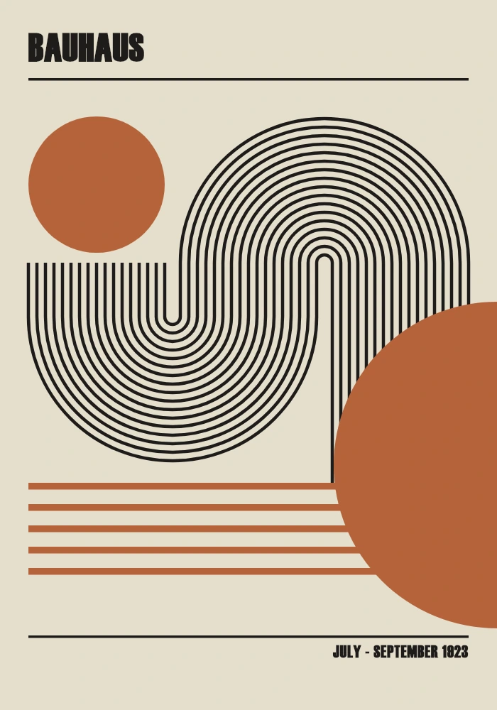
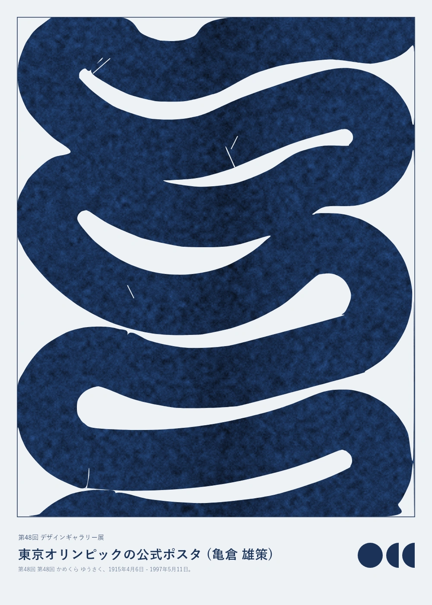
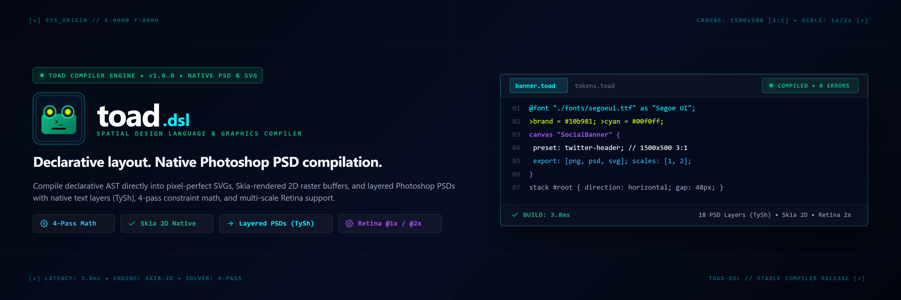
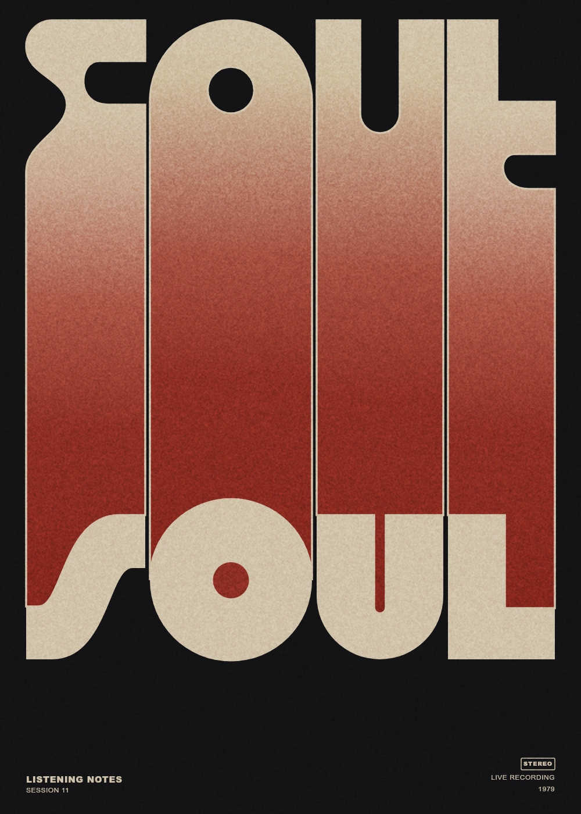

# 🐸 TOAD Designs & Showcases

A curated collection of design systems, posters, banners, and vector artwork crafted with the [TOAD DSL](https://github.com/razy-me/toad) (Declarative Visual Design Language & Compiler).

> [!NOTE]
> **Attribution & Design Studies**:
> Several designs and motifs in this repository are not original creations, but deliberate **1:1 design studies and digital recreations** of iconic historical posters (e.g., Herbert Bayer's Bauhaus exhibition poster, Yusaku Kamekura's Tokyo 1964 Olympic poster) or online inspirations. They serve as real-world stress tests and benchmarks to demonstrate the layout expressiveness, typography engine, and rendering fidelity of the TOAD compiler.

---

## 🎨 Showcases

| Project | Preview | Description | Source & Formats |
| :--- | :---: | :--- | :--- |
| **[Bauhaus 1923](./bauhaus-1923/)** |  | Geometric Bauhaus exhibition poster recreation highlighting layout math, color blocking, and typography. | [`.toad`](./bauhaus-1923/bauhaus_1923.toad) · [SVG](./bauhaus-1923/bauhaus_1923.svg) · [PSD](./bauhaus-1923/bauhaus_1923.psd) · PNG / WebP |
| **[Kamekura Tokyo 1964](./kamekura-tokyo-poster/)** |  | Yusaku Kamekura's iconic Tokyo 1964 Olympic poster recreated with textured paper compositing and emblem layout. | [`.toad`](./kamekura-tokyo-poster/kamekura_poster.toad) · [SVG](./kamekura-tokyo-poster/kamekura_poster.svg) · [PSD](./kamekura-tokyo-poster/kamekura_poster.psd) · PNG / WebP |
| **[Social Banner](./social-banner/)** |  | High-impact GitHub repository and social preview cards showcasing container stacks, gradients, and badges. | [`.toad`](./social-banner/banner.toad) · [SVG](./social-banner/banner.svg) · [PSD](./social-banner/banner.psd) · PNG / WebP |
| **[Soul Poster](./soul-poster/)** |  | Expressive design demonstrating mesh/radial gradient glows, custom texture blending, and typography. | [`.toad`](./soul-poster/soul_poster.toad) · [SVG](./soul-poster/soul_poster.svg) · [PSD](./soul-poster/soul_poster.psd) · PNG / WebP |

---

## 🛠️ Working with this Repository

### Clone
```bash
git clone https://github.com/razy-me/toad-designs.git
```

### Compiling Designs with TOAD
Compile any `.toad` design file using the TOAD CLI compiler:

```bash
# Render to SVG & PNG
toad build path/to/design.toad

# Export all targets (SVG, PSD, PNG, WebP)
toad export path/to/design.toad
```
