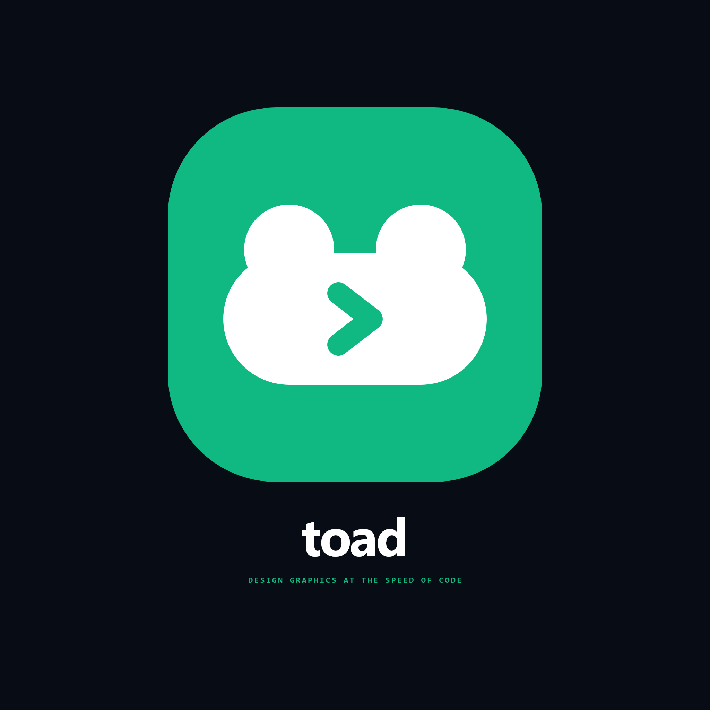
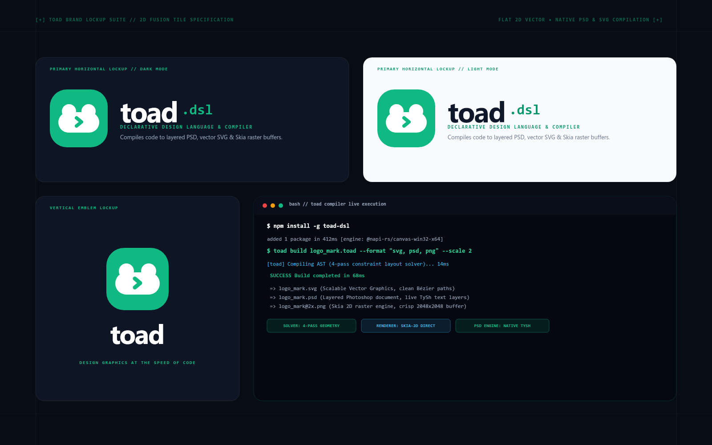
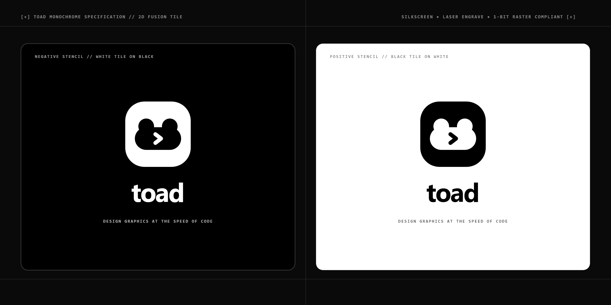
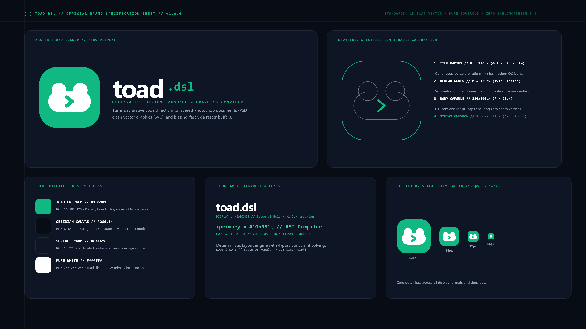

# 🐸 TOAD DSL — Official Brand & Logo Suite

Official brand identity, app icons, and vector logo marks for the **TOAD DSL** (Declarative Visual Design Language & Compiler). Each design project and its compiled exports reside in its own dedicated subfolder with synchronized font binaries.

---

## 🎨 Master Brand Identity

| Asset | Preview | Description | Source & Formats |
| :--- | :---: | :--- | :--- |
| **[Standalone Frog Icon](./icon-standalone/)** |  | Pure transparent 2D frog icon. No background, no box, tightly clipped canvas with syntax prompt (`>`). | [`.toad`](./icon-standalone/toad_icon.toad) · [SVG](./icon-standalone/toad_icon.svg) · [PSD](./icon-standalone/toad_icon.psd) · PNG / WebP |
| **[Master 2D Fusion Tile](./logo-mark/)** |  | Master 1:1 app icon & signet. Flat 2D emerald squircle with white toad silhouette and variable prompt (`>`). | [`.toad`](./logo-mark/toad_logo_mark.toad) · [SVG](./logo-mark/toad_logo_mark.svg) · [PSD](./logo-mark/toad_logo_mark.psd) · PNG / WebP |
| **[Brand Lockup Suite](./logo-lockup/)** |  | Horizontal (Dark & Light) and vertical stacked lockups with the `toad.dsl` wordmark and CLI console card. | [`.toad`](./logo-lockup/toad_logo_lockup.toad) · [SVG](./logo-lockup/toad_logo_lockup.svg) · [PSD](./logo-lockup/toad_logo_lockup.psd) · PNG / WebP |
| **[Monochrome Stencils](./logo-monochrome/)** |  | High-contrast 1-bit positive and negative stencils for silkscreen print, laser engraving, and single-color swag. | [`.toad`](./logo-monochrome/toad_logo_monochrome.toad) · [SVG](./logo-monochrome/toad_logo_monochrome.svg) · [PSD](./logo-monochrome/toad_logo_monochrome.psd) · PNG / WebP |
| **[Brand Guidelines Sheet](./brand-sheet/)** |  | Full 1920x1080 architectural brand board with CAD geometry calibration, color swatches, typography, and scale ladder. | [`.toad`](./brand-sheet/toad_brand_sheet.toad) · [SVG](./brand-sheet/toad_brand_sheet.svg) · [PSD](./brand-sheet/toad_brand_sheet.psd) · PNG / WebP |

---

## 📁 Directory Architecture

```
c:\toad-designs\logo\
├── icon-standalone\            # Pure 2D Frog Icon (Transparent, No Box)
│   ├── toad_icon.toad          # Emerald frog (#10b981)
│   ├── black\                  # 100% Black frog icon (no background)
│   │   ├── toad_icon_black.toad
│   │   └── ... (exports: png, svg, psd, webp)
│   ├── white\                  # 100% White frog icon (no background)
│   │   ├── toad_icon_white.toad
│   │   └── ... (exports: png, svg, psd, webp)
│   └── ... (exports: png, svg, psd, webp)
├── logo-mark\                  # Master 1:1 App Icon & Signet (2048x2048)
│   ├── fonts\                  # Synchronized typography (Photopea drag & drop)
│   ├── toad_logo_mark.toad     # Master DSL source
│   ├── toad_logo_mark.png      # 2x Master PNG buffer
│   ├── toad_logo_mark.svg      # Clean vector SVG
│   ├── toad_logo_mark.psd      # Layered Photoshop document
│   └── toad_logo_mark.webp     # WebP format
├── logo-lockup\                # Brand Lockups & CLI Card (3200x2000)
│   ├── fonts\
│   ├── toad_logo_lockup.toad
│   └── ... (exports)
├── logo-monochrome\            # High-Contrast Stencils (2800x1400)
│   ├── fonts\
│   ├── toad_logo_monochrome.toad
│   └── ... (exports)
└── brand-sheet\                # Master Guidelines & CAD Blueprint (3840x2160)
    ├── fonts\
    ├── toad_brand_sheet.toad
    └── ... (exports)
```

---

## 📐 Geometric Architecture & Anatomy

The **TOAD 2D Fusion Tile** is constructed from pure mathematical primitives:
1. **The Squircle Chassis**: 540 × 540 px with a golden-ratio corner radius ($R = 156\,\text{px}$, $n = 4$ curvature profile) filled in `#10b981` (TOAD Emerald).
2. **The Ocular Domes**: Dual symmetrical circular domes ($\varnothing = 130\,\text{px}$) intersecting the body capsule at optical canvas centers.
3. **The Body Capsule**: 380 × 190 px with semicircular pill caps ($R = 95\,\text{px}$) in `#ffffff` (Pure White).
4. **The Variable Syntax Prompt (`>`)**: TOAD's signature variable syntax marker (`>var = ...;`), laser-cut into the center with 32px stroke thickness and perfectly rounded caps (`stroke-cap: round; stroke-join: round;`).

---

## 🎨 Official Color Tokens

| Token | Hex | RGB | Role |
| :--- | :---: | :---: | :--- |
| `>toadEmerald` | `#10b981` | `16, 185, 129` | Primary brand identity color, squircle tile & accents |
| `>emeraldDark` | `#059669` | `5, 150, 105` | Secondary deep emerald for light mode typography |
| `>bgCanvas` | `#080c14` | `8, 12, 20` | Obsidian developer-dark background substrate |
| `>bgCard` | `#0e1626` | `14, 22, 38` | Surface containers, card panels & navigation bars |
| `>toadWhite` | `#ffffff` | `255, 255, 255` | Toad silhouette, display typography & high-contrast elements |
| `>textMuted` | `#94a3b8` | `148, 163, 184` | Monospace comments, secondary labels & dimension indicators |

---

## 🔤 Typography

- **Display & Headlines**: `Segoe UI Bold` (`-2.5px` tracking)
- **Code & Telemetry**: `Consolas Bold` (`+1.5px` tracking)
- **Body & Captions**: `Segoe UI Regular` (`1.5` line-height)

Each subfolder contains its own [`fonts/`](./logo-mark/fonts/) directory so any project can be dragged directly into **Photopea** and Photoshop with zero missing font alerts.

---

## 🛠️ Compiling Assets

Compile individual projects at double resolution without `@2x` suffixes:

```bash
# 1. Compile master 1:1 mark (2048x2048)
cd logo-mark && toad build toad_logo_mark.toad -s 2

# 2. Compile brand lockups (3200x2000)
cd ../logo-lockup && toad build toad_logo_lockup.toad -s 2

# 3. Compile monochrome stencils (2800x1400)
cd ../logo-monochrome && toad build toad_logo_monochrome.toad -s 2

# 4. Compile master brand sheet (3840x2160 UHD)
cd ../brand-sheet && toad build toad_brand_sheet.toad -s 2
```
